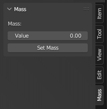

# rFactor2 Suspension Model Exporter Addon for Blender
rFactor 2 Suspension Model Exporter is an addon for Blender to export the suspension definition of a vehicle into a PM suspension model file to be used in rFactor2.

## Installation
1. Download the latest python script from the source directory (e.g. "export_rfactor2_pm_v0_2_0.py")
2. Start Blender
3. Open the "Edit" menu on the top bar of Blender.
4. Click on "Preferences..."
5. Click on "Add-ons"
6. Click on "Install..."
7. Browse to the location where you downloaded the python script.
8. Select the python script.
9. Click on "Install Add-on"

Note: The addon is not enabled after install, please tick the checkbox on the left side to activate it.

## Working Principle
The export script will search your Blender scene for default suspension objects and writes the required entries into a PM file. In case the weight was set for these objects (option available through a new menu in the UI), the export includes a simplified calculation of the object's inertia. Please see the notes on setting the weight and inertia calculation below.

## Default suspension objects
body
fl_fore_lower
fl_fore_upper
fl_rear_lower
fl_rear_upper
fl_spindle
fl_steering
fl_wheel
fr_fore_lower
fr_fore_upper
fr_rear_lower
fr_rear_upper
fr_spindle
fr_steering
fr_wheel
fr_spindle
fr_wheel
rl_fore_lower
rl_fore_upper
rl_rear_lower
rl_rear_upper
rl_spindle
rl_toelink
rl_wheel
rr_fore_lower
rr_fore_upper
rr_rear_lower
rr_rear_upper
rr_spindle
rr_toelink
rr_wheel
fuel tank
driver head

Please note that for fuel_tank and driver_head only default settings will be exported because headphysics and HDV do overwrite these settings anyway.

Please also note that suspension bodies will be exported with inertia set to 0 if no weight was set for the respective object.

## Setting weight
When the addon is active, there will be a new tab added on the right side in the 3D Viewport:

The value set is weight in kg and will be used to calculate the inertia (see details below).

## Inertia calculation
The intertia will be calculated with simplified formulas for a box (body) or cylinder (wheels, spindles) and is using the weight and the x-y-z-dimensions of the respective objects. This can result in relatively accurate inertia (body of a touring or road car) or absolutely wrong inertia (wheels are no cylinders, they are more of a holow cylinder with an uneven weight distribution). You must keep this in mind when sizing the objects or setting their weight. Should the vehicle behave very odd, you might want to play with the inertia values or better calculate them with more accurate formulas.
However. As a starting point, you may want to size the body box to the outlines of your vehicle and set the weight to the approx. weight of the bodywork and chassis. For the wheels and spindles you may scale the cylinders a little smaller than their real counterparts and set the weight to values lower than the actual weight.

## Final notes
Please only use simplified 3D objects for the representation of the suspension objects. I recommend you to use my "Blender rF2 Studio - Car" application template (https://github.com/MrFuNK1/Blender-rF2-Studio) that already has the required simplified suspension objects included. Of course you can (and maybe should) put 3D objects of your vehicle into the scene, but make sure to not use any of the default suspension objects names or the script will fail.
